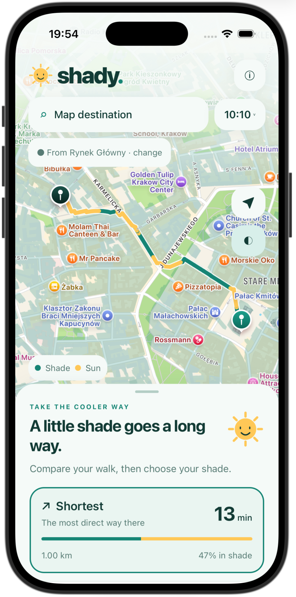
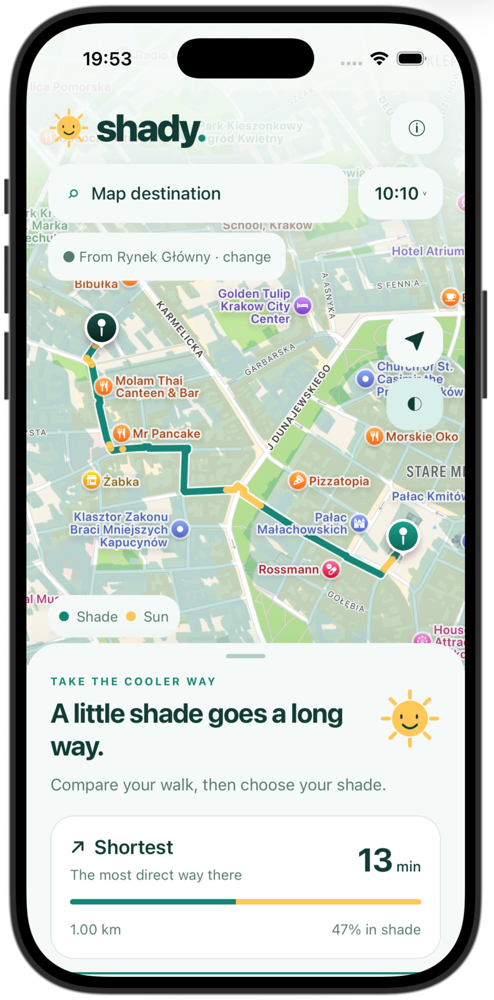

<p align="center">
  
</p>
<h1 align="center">shady.</h1>
<p align="center"><strong>A little shade goes a long way.</strong><br/>A cooler way to explore Kraków, one walk at a time.</p>

<p align="center"><a href="https://shady-krakow.expo.app"><strong>Try Shady ↗</strong></a></p>

<p align="center">
  <a href="#the-idea">The idea</a> · <a href="#try-shady">Try Shady</a> · <a href="#take-it-for-a-walk">Take it for a walk</a> · <a href="docs/TECHNICAL.md">Under the hood</a>
</p>

<table>
  <tr><th align="center">Shortest</th><th align="center">More shade</th></tr>
  <tr>
    <td align="center"></td>
    <td align="center"></td>
  </tr>
</table>
<p align="center"><strong>Same destination. A cooler journey.</strong></p>

## The idea

A city walk should be about the places you discover. On a sunny day, the most direct route can leave you walking in the sun for much of the journey.

**Shady helps you choose a walk with less sun.** Pick a destination and departure time, then compare **Shortest** with **More shade**. See building shadows and likely tree shade, how much sunny walking you could save, and how many extra minutes it takes. The shaded option stays within **25% extra distance**.

Built for the hackathon, Shady plans walks across Kraków's connected public walking network. Shade combines building shadows at departure with likely tree cover in summer. Trees are an approximation—wooded paths can still have sunny gaps.

## Try Shady

**Open [Shady](https://shady-krakow.expo.app) on your phone or laptop.** No installation needed. Choose a destination in Kraków, compare the two paths, and take the cooler way.

The city engine can take about a minute to wake up after an idle period. For an instant hackathon preview, choose a **Saved demo** summer walk from the results sheet.

**Prefer the native app?** Install Expo Go on your iPhone and Node.js 22.13+ on your Mac, then:

```sh
cd ~/Developer/shady/mobile
npm ci
cp .env.example .env
npx expo start --go --lan --clear
```

Keep the phone and Mac on the same Wi-Fi, scan the QR code with the iPhone Camera, and open it in Expo Go. The app uses our hosted city engine.

[Local development and city data](docs/TECHNICAL.md) · [Hosting and deployment](docs/DEPLOYMENT.md)

## Take it for a walk

1. **Choose your destination.** Search for a place in Kraków, or long press the map to drop a pin. Change **From** to choose your start; the arrow uses your location.
2. **Choose your moment.** Tap **Now** to explore a different departure time. Watch the shade change with the sun.
3. **Compare your paths.** Tap **Shortest** or **More shade**. Teal marks building shade, muted green marks likely tree shade, and yellow marks sun. The cards show the trade-off in distance, time and shade.
4. **Start walk.** Follow the highlighted path with live progress and remaining distance. Keep Shady open; tap the arrow to resume camera following after panning.

**Want the quick demo?** Open the results sheet and choose a saved summer walk at **10:00**, **13:00** or **16:00**. Saved walks work without the backend once Expo has loaded the app, and their previews keep GPS off. **Saved demo** is always clearly labeled.

[How shade works, logs, tests and measured performance →](docs/TECHNICAL.md)

## Sources

Shady connects open city data with the position of the sun:

- **Walking paths, wooded areas and city boundary:** © [OpenStreetMap contributors](https://www.openstreetmap.org/copyright), ODbL; regional data from [Geofabrik](https://download.geofabrik.de/europe/poland/malopolskie.html).
- **Building footprints and heights:** [GUGiK 3D buildings, LoD1 2024](https://www.geoportal.gov.pl/en/data/other-data/3d-models-of-building/), CC BY 4.0, covering Kraków and neighboring counties.
- **Solar position:** [pvlib](https://pvlib-python.readthedocs.io/en/stable/).
- **Address search:** [Nominatim](https://operations.osmfoundation.org/policies/nominatim/).

[Full attribution and data notes](docs/TECHNICAL.md#sources-and-attribution) · [Demo walkthrough](docs/WALKTHROUGH.md)
