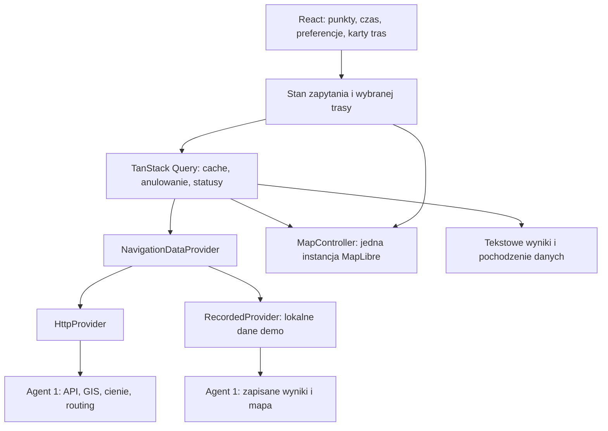

# Plan frontendu i integracji — ShadePath, HackYeah 2026

## 1. Cel, stan projektu i zakres MVP

**Budujemy mapę Krakowa pokazującą zmienne cienie budynków oraz porównanie tras dla rodzica z wózkiem: „Najszybsza” i „Mniej słońca”, z możliwością unikania schodów.**

Ustalenia z rozmowy:

- Główna kategoria: **SMART CITY**; dodatkowe pozycjonowanie: „Kraków bez barier”.
- Obszar: centrum Krakowa — Stare Miasto, Wawel i Kazimierz.
- Pokaz na **localhost**, z przygotowanym scenariuszem działającym bez internetu.
- Wymagane materiały końcowe: prezentacja i nagranie.
- Agent 1 nie ustalił jeszcze kontraktów API.
- Interfejs po polsku; robocza nazwa **ShadePath**.
- W MVP zacienienie oznacza wynik modelu cieni budynków. Nie przedstawiamy go jako pomiaru temperatury.

**Stan repozytorium:** zainicjalizowany Git, skonfigurowany GitHub i SSH; brak kodu aplikacji, manifestów zależności i pięciu plików koordynacyjnych. Dostępne są Node.js 24 i npm. Planowanie nie zmienia plików repozytorium.

**P0 obejmuje:** prawdziwy podkład i obrysy budynków, cienie, wybór daty i czasu, punkty A/B, dwie alternatywy tras, porównanie metryk, filtr schodów, pochodzenie danych, obsługę błędów i pełny przygotowany pokaz offline.

**Poza P0:** logowanie, śledzenie GPS, nawigacja zakręt po zakręcie, prognoza pogody, model cieni drzew, cały Kraków, społecznościowe zgłoszenia oraz gwarantowanie dostępności dla wszystkich użytkowników.

SMART CITY premiuje innowację, użyteczność i projekt interfejsu, dlatego mapa i porównanie tras pozostają centrum produktu. W zgłoszeniu trzeba wskazać wykorzystane dane, biblioteki i istotne użycie AI. :codex-file-citation{path="/home/dnikitsin-lenovo/Downloads/Details - SMART CITY.pdf" purpose="source"}

Kryteria „Kraków bez barier” uzasadniają dodanie już w P0 źródeł, dat, statusów wiarygodności i tekstowego odpowiednika informacji z mapy. Brak danych nie może oznaczać potwierdzenia dostępności. :codex-file-citation{path="/home/dnikitsin-lenovo/Downloads/KRYTERIA Kraków Bez Barier.pdf" purpose="source"}

**Sprawa organizacyjna do potwierdzenia przez zespół:** dokumenty różnią się godzinami, platformą zgłoszenia i punktacją drugiej kategorii. SMART CITY podaje „11:00 PM” oraz HackTribe, podczas gdy opis zadania wskazuje Challenge Rocket. :codex-file-citation{path="/home/dnikitsin-lenovo/Downloads/Rules - SMART CITY.pdf" purpose="source"} Regulamin „Cracow without barriers” podaje 11:00, zgłoszenie po polsku, maksymalnie 10 slajdów i film do 3 minut. W planie przyjmujemy te limity materiałów; termin i platformę potwierdza zespół u organizatora. :codex-file-citation{path="/home/dnikitsin-lenovo/Downloads/RULES Cracow Without Barriers.pdf" purpose="source"}

## 2. Architektura, mapa i interfejs

### Technologie i granice modułów

**React + TypeScript + Vite + MapLibre GL JS**, CSS Modules i zmienne CSS. TanStack Query obsługuje pobieranie oraz cache; `date-fns-tz` konwersję czasu. Testy: Vitest, React Testing Library i Playwright. Instalujemy stabilne wydania i zapisujemy lockfile.

MapLibre wybieramy ze względu na WebGL, wspólne źródła GeoJSON i aktualizowanie danych istniejących warstw. Leaflet obsługuje GeoJSON oraz renderowanie SVG/Canvas i byłby odpowiedni dla prostszej mapy, ale w tym projekcie priorytetem są często zmieniane poligony. Nie utrzymujemy dwóch silników mapowych. [MapLibre](https://maplibre.org/maplibre-gl-js/docs/), [Leaflet](https://leafletjs.com/reference.html).



Proponowana struktura:

```text
frontend/
  src/
    app/                 # AppShell, stan wyborów, tryb danych
    components/          # wspólne kontrolki
    features/
      journey/           # wybór A/B i lokalne wyszukiwanie
      time/              # data, suwak, efektywny czas
      routes/            # karty i tekstowe szczegóły tras
      preferences/       # filtr schodów
      provenance/        # źródła, wiarygodność, ograniczenia
      demo/              # wybór i reset scenariusza
    map/                 # MapView, MapController, sources, layers
    data/                # interfejs, adapter HTTP, adapter zapisów
    styles/              # kolory, typografia, układ
  tests/                 # kontrakty, integracja UI, E2E
  public/demo/           # generowana kopia pakietu A1

contracts/
  api-v1.openapi.yaml

data/demo/v1/            # A1: podkład, budynki, cienie, trasy, źródła
AGENTS.md
NOTES.md
DECISIONS.md
TODO.md
HANDOFF.md
```

**Granice React:**

- `AppShell` odpowiada za układ i stan wyborów, bez obliczeń GIS.
- `JourneyControls`, `TimeControls`, `PreferencesPanel` emitują zmiany zapytania.
- `RouteComparison` i `RouteDetails` prezentują te same dane, które trafiają na mapę.
- `ProvenancePanel` prezentuje informacje o konkretnym odcinku lub metryce.
- `MapView` montuje mapę raz; `MapController` aktualizuje źródła, filtry i kamerę.
- Adaptery danych nie importują React ani MapLibre. Komponenty nie wykonują bezpośrednich żądań HTTP.

### Podkład i warstwy

**Podkład P0 jest lokalny:** uproszczone rzeczywiste drogi, ciągi piesze, woda i zieleń wyeksportowane przez A1 z danych OSM. Budynki są osobnym źródłem. Kilka nazwanych miejsc otrzymuje lekkie etykiety HTML. Dzięki temu pokaz nie zależy od zewnętrznych kafelków, fontów ani kluczy API.

Nie pobieramy hurtowo standardowych kafelków OSM na potrzeby offline; lokalny podkład powstaje z danych wektorowych. Zachowujemy atrybucję i informacje licencyjne. [Polityka kafelków OSM](https://operations.osmfoundation.org/policies/tiles/).

| Źródło | Warstwy, od dołu | Aktualizacja |
|---|---|---|
| `basemap` | tło, woda, zieleń, drogi, ciągi piesze | raz na wersję danych |
| `shadows` | półprzezroczyste poligony grafitowe | po zmianie czasu lub obszaru |
| `buildings` | jasne wypełnienie, cienki obrys | po zmianie obszaru |
| `routes` | obwódki, alternatywy, wybrana trasa | po przeliczeniu |
| `barriers` | oznaczenia schodów na trasie | z wyników routingu |
| `endpoints` | punkty A/B | po zmianie wyboru |

- Mapa 2D, północ u góry, bez pochylania.
- Cienie pozostają pod budynkami; trasy nad nimi.
- „Najszybsza” ma kolor niebieski, „Mniej słońca” ciemnozielony. Wybrana trasa jest grubsza, z obwódką i oznaczeniem tekstowym na karcie.
- Kliknięcie karty lub linii wybiera tę samą trasę. Zmiana wyboru używa filtrów/stylu, bez ponownego pobierania.
- Kliknięcie bariery otwiera panel szczegółów, dostępny również z listy tekstowej.
- Budynki nie są komponentami React; renderuje je jedno źródło GeoJSON.

**Wydajność:** źródła i warstwy powstają raz; geometria jest aktualizowana przez `setData`. A1 upraszcza geometrię i usuwa zbędne właściwości z odpowiedzi. Pobieramy obszar widoku z 20% zapasem, po zakończeniu ruchu kamery. [Zalecenia wydajności MapLibre](https://maplibre.org/maplibre-gl-js/docs/guides/large-data/).

Początkowy obszar projektu: bbox `[19.920, 50.040, 19.965, 50.075]`, kolejność zachód–południe–wschód–północ. Manifest A1 jest ostatecznym źródłem faktycznego pokrycia. Poza nim aplikacja pokazuje granicę obsługiwanego terenu.

### Czas i spójność wyników

- Strefa produktu: **Europe/Warsaw**, niezależnie od strefy komputera.
- Krok czasu: **10 minut**; zaokrąglenie w dół. UI pokazuje rzeczywistą godzinę danych.
- Suwak reaguje od razu; żądania cieni mają debounce 200 ms. Zwolnienie suwaka wysyła ostatni wybór natychmiast.
- Zmiana czasu, daty lub punktów anuluje nieaktualne żądania. Dodatkowa kontrola klucza zapytania blokuje spóźnione odpowiedzi.
- Routing przeliczamy po zatwierdzeniu czasu, nie przy każdym ruchu suwaka.
- Podczas aktualizacji wcześniejsze wyniki są oznaczone jako nieaktualne. Nie porównujemy kart dla 10:00 z cieniami dla 15:00.
- Cache cieni: wersja danych + efektywny czas + obszar; maksymalnie 12 ostatnich odpowiedzi.
- Nie interpolujemy dowolnie kształtów cieni. Płynność interakcji wynika z cache i szybkiej podmiany danych.
- Po zachodzie słońca pokazujemy odpowiedni komunikat; nie opisujemy całej trasy jako „100% cienia”.

Model P0 ocenia nasłonecznienie dla **jednej wybranej chwili**, bez symulowania przesuwania się słońca podczas marszu.

### Wybór trasy i układ

**Desktop:** mapa zajmuje całe tło, panel 360 px z lewej zawiera punkty i wyniki, sterowanie czasem pozostaje wyraźnie widoczne przy dolnej krawędzi.

**Telefon poniżej 768 px:** punkty u góry, mapa w centrum, zwijany panel wyników u dołu. Panel ma przycisk rozwijania; jego obsługa nie wymaga gestu przeciągania. Kontrolki czasu i atrybucja nie mogą być zasłonięte.

P0 wyboru A/B:

- lokalne wyszukiwanie nazwanych miejsc z manifestu;
- przyciski „Wybierz start/cel na mapie”;
- zamiana punktów i reset scenariusza;
- obsługa klawiaturą przez listę miejsc;
- pełne wyszukiwanie adresów dopiero w P1.

Karta trasy pokazuje: czas, dystans, udział słońca/cienia, różnicę czasu wobec najszybszej oraz informację o schodach i niepełnych danych. Różnicę nasłonecznienia podajemy w **punktach procentowych**, bez mylenia jej z procentową redukcją.

Filtr „Unikaj schodów” wyklucza odcinki z informacją o schodach. Przy niepełnych danych UI wyjaśnia, że brak oznaczonych schodów nie potwierdza całkowicie bezstopniowej trasy. Nie dodajemy w P0 nieaktywnych filtrów nachylenia, ławek i nawierzchni.

## 3. Kontrakt z Agentem 1 i działanie offline

### Interfejs konsumenta

Jedyny interfejs używany przez frontend:

```ts
interface NavigationDataProvider {
  getManifest(signal: AbortSignal): Promise<Manifest>;

  getBuildings(
    bbox: BBox,
    signal: AbortSignal
  ): Promise<Envelope<BuildingCollection>>;

  getShadows(
    request: { bbox: BBox; at: string },
    signal: AbortSignal
  ): Promise<Envelope<ShadowCollection>>;

  getRoutes(
    request: RouteRequest,
    signal: AbortSignal
  ): Promise<Envelope<RouteResult>>;
}
```

API HTTP:

| Metoda i adres | Wejście | Wynik |
|---|---|---|
| `GET /api/v1/manifest` | — | obszar, możliwości, scenariusze, źródła, URL podkładu |
| `GET /api/v1/buildings` | `bbox=west,south,east,north` | GeoJSON budynków |
| `GET /api/v1/shadows` | `bbox`, `at` | GeoJSON cieni i efektywny czas |
| `POST /api/v1/routes` | JSON `RouteRequest` | trasy, metryki, odcinki |

Frontend korzysta z relatywnego `/api/v1`; proxy Vite kieruje żądania do backendu A1. Adres backendu jest konfigurowalny przez `API_PROXY_TARGET`, domyślnie `http://127.0.0.1:8000`.

### Typy i znaczenie danych

Współrzędne to **WGS84 `[longitude, latitude]`**, dystans w metrach, czas marszu w sekundach, nachylenie w procentach. Daty API są ISO 8601 w UTC z `Z`.

```ts
type LngLat = [number, number];
type BBox = [number, number, number, number];
type Profile = "fastest" | "shaded";

type Source = {
  name: string;
  url: string;
  license: string;
  fetchedAt: string;
};

type Fact<T> = {
  value: T | null;
  sourceIds: string[];
  verifiedAt: string | null;
  status: "verified" | "reported" | "estimated" | "unknown" | "conflict";
  coveragePct: number;
};

type Envelope<T> = {
  data: T;
  meta: {
    schemaVersion: "1";
    datasetVersion: string;
    mode: "live" | "recorded" | "synthetic";
    effectiveAt: string | null;
    daylight: boolean | null;
    coverageBbox: BBox;
    sourceIds: string[];
    warnings: string[];
  };
};

type RouteRequest = {
  origin: LngLat;
  destination: LngLat;
  at: string;
  profiles: Profile[];
  preferences: { avoidStairs: boolean };
};

type Route = {
  id: string;
  profiles: Profile[];
  geometry: GeoJSON.Feature<GeoJSON.LineString>;
  distanceMeters: number;
  durationSeconds: number;
  exposure: {
    shadePct: number | null;
    sunPct: number | null;
    unknownPct: number | null;
  };
  stairsSegments: Fact<number>;
  stepCount: Fact<number>;
  maxSlopePct: Fact<number>;
  surfaceMeters: Fact<Record<string, number>>;
  segments: GeoJSON.FeatureCollection<
    GeoJSON.LineString,
    {
      segmentId: string;
      name: string | null;
      stairs: Fact<boolean>;
      surface: Fact<string>;
      slopePct: Fact<number>;
    }
  >;
};

type RouteResult = {
  routes: Route[];
  snappedOrigin: LngLat | null;
  snappedDestination: LngLat | null;
};
```

Dodatkowe dokładne ustalenia kontraktu:

- `BuildingCollection`: `FeatureCollection<Polygon | MultiPolygon>`; stabilne `Feature.id`, właściwości `buildingId`, `heightMeters: Fact<number>`.
- `ShadowCollection`: `FeatureCollection<Polygon | MultiPolygon>`; stabilne identyfikatory w obrębie wyniku, `buildingId: string | null`. `null` pozwala A1 zwracać połączone poligony.
- `Manifest`: `schemaVersion`, `datasetVersion`, `timezone`, `coverageBbox`, `basemapUrl`, `sources: Record<string, Source>`, `places`, `scenarios`, `defaultScenarioId`, `capabilities`.
- `places`: rekordy `{id, name, coordinates}`.
- `scenarios`: rekordy `{id, title, originPlaceId, destinationPlaceId, defaultAt, availableDates, timeRange}`.
- `capabilities`: `{arbitraryPoints, avoidStairs, availableDates, timeRange, timeStepMinutes: 10}`. `availableDates: null` oznacza dowolną datę obsługiwaną przez backend; lista oznacza dostępne zapisy.
- Podkład pod `basemapUrl` to GeoJSON z właściwością `kind`: `water`, `park`, `road`, `footway` albo `place`; opcjonalnym `name` i stabilnymi identyfikatorami.

Zasady semantyczne:

- W dzień `shadePct + sunPct + unknownPct = 100`, liczone względem całej długości trasy. Nie ukrywamy nieoszacowanych fragmentów.
- W nocy metryki ekspozycji są `null`, a `daylight=false`.
- `stairsSegments` liczy odcinki, `stepCount` stopnie. To różne wartości.
- Zero przy niepełnym pokryciu nie uprawnia UI do komunikatu „bez schodów”.
- Data pobrania źródła nie jest datą weryfikacji terenowej.
- Jeśli obie funkcje celu dają tę samą geometrię, A1 zwraca jedną trasę z oboma profilami. UI pokazuje, że oba kryteria wskazują ten sam wynik.
- Pusta tablica tras oznacza brak rozwiązania; frontend nie rozluźnia sam filtra.
- A1 uwzględnia budynki poza widokiem, których cienie wpadają w żądany bbox. Bbox odpowiedzi opisuje pokrycie wyniku, nie obszar wejściowych budynków.

Błędy mają format `{error: {code, message}}`: `INVALID_REQUEST` → 400; `OUTSIDE_COVERAGE`, `NO_NEARBY_PATH`, `UNSUPPORTED_SCENARIO` → 422; `DATA_UNAVAILABLE` → 503. Brak trasy w poprawnym zapytaniu to 200 z pustą tablicą.

### Dane demonstracyjne i fallback

Rozdzielamy trzy sytuacje:

1. **Fixture testowy:** niewielkie dane syntetyczne do tworzenia UI i testów; jawnie oznaczone.
2. **Zapis demonstracyjny:** rzeczywiste budynki oraz zapisane wyniki modelu A1; pełny pokaz offline.
3. **API:** obliczenia backendu, również lokalnego.

Domyślny start do pokazu to tryb zapisany. Przełącznik „Demo / Obliczenia” zmienia cały provider i ładuje spójny zestaw: punkty, czas, cienie i trasy.

Pakiet offline A1 obejmuje:

- podkład, budynki i źródła;
- daty **15 lipca 2026** i **3 października 2026**;
- godziny **10:00–15:00 co 10 minut**;
- scenariusz porównania nasłonecznienia;
- scenariusz, w którym wykluczenie oznaczonych schodów zmienia trasę;
- wyniki dla obu ustawień filtra schodów;
- wariant pokazujący niepełne lub sprzeczne dane.

Współrzędne scenariuszy ustala A1 na podstawie grafu. A2 używa ich z manifestu, bez wymyślania bariery w konkretnym miejscu. Jeżeli jedna para punktów spełnia oba scenariusze, używamy jej w całym pokazie.

Zapisy są ładowane na żądanie, poza głównym pakietem JavaScript. Skrypt frontendu kopiuje pakiet A1 do zasobów aplikacji przed uruchomieniem lub buildem. A2 nie edytuje ręcznie wyników GIS.

**Tryb zapisany nie udaje routingu dla dowolnych punktów.** Przy nieobsługiwanej parze lub dacie pokazuje ograniczenie i wybór dostępnego scenariusza. Awaria API nie podmienia po cichu wyników na fikcyjne — użytkownik dostaje przycisk przejścia do demo.

## 4. Podział pracy, backlog i integracja

### Koordynacja we wspólnym repozytorium

Przed wdrażaniem ponownie odczytujemy pliki koordynacyjne. Jeśli nadal nie istnieją, A2 inicjalizuje propozycję podziału i kontraktu:

| Plik | Zawartość |
|---|---|
| `AGENTS.md` | cel, architektura, właściciele katalogów, konwencje, integracja |
| `NOTES.md` | ustalenia o danych, wydajności i wymaganiach konkursowych |
| `DECISIONS.md` | MapLibre, dwa profile, model czasu, tryby danych, ograniczenia |
| `TODO.md` | `BLOCKER/P0/P1/P2/DONE`, właściciel, stan i kryterium ukończenia |
| `HANDOFF.md` | producent, konsument, kontrakt, status i ograniczenia każdego przekazania |

A1 odpowiada za backend, GIS, routing, skrypty pozyskania danych i `data/`. A2 za `frontend/`. Kontrakt jest wspólny; A2 przygotowuje wersję konsumencką, a A1 potwierdza ją przed integracją.

Przed zadaniem agent sprawdza i oznacza jego przejęcie. Wspólne pliki są ponownie odczytywane przed edycją; nie edytujemy ich równocześnie. Każda zmiana API trafia najpierw do kontraktu i `HANDOFF.md`. Commity obejmują wyłącznie własne zmiany i jawnie wskazane pliki wspólne.

### Backlog Agenta 2

| Priorytet | Zadanie | Warunek ukończenia | Zależność |
|---|---|---|---|
| BLOCKER `[SHARED]` | Uzgodnić kontrakt v1 | A1 i A2 potwierdzają jednostki, czas, metadane i błędy | przed integracją |
| BLOCKER `[A1]` | Dostarczyć dane demonstracyjne | realne budynki, modelowane cienie, dwie trasy i scenariusz schodów | przed uznaniem demo za gotowe |
| P0 `[A2]` | Szkielet i adaptery | frontend uruchamia się z fixture; komponenty nie zależą od HTTP | można zacząć od razu |
| P0 `[A2]` | Mapa i warstwy | budynki, cienie, punkty i trasy działają w jednej instancji mapy | fixture wystarcza |
| P0 `[A2]` | Data i czas | krok 10 min, cache, anulowanie, poprawny efektywny czas | fixture wystarcza |
| P0 `[A2]` | A/B i porównanie | wybór z listy/mapy, karty, wyróżnienie trasy, różnice metryk | fixture wystarcza |
| P0 `[A2]` | Schody i pochodzenie danych | filtr zmienia żądanie; braki i źródła widoczne w UI | fixture, potem dane A1 |
| P0 `[A2]` | Responsive i dostępność | pełna ścieżka klawiaturą i tekstowy odpowiednik mapy | niezależne od backendu |
| P0 `[SHARED]` | Integracja i pakiet offline | te same widoki działają z API i zapisami | przekazania A1 |
| P0 `[A2]` | Test demo i materiały | powtarzalny pokaz, nagranie ≤3 min, prezentacja ≤10 slajdów | stabilne P0 |
| P1 `[A2]` | Nawierzchnia i nachylenie | dodatkowe preferencje aktywne dopiero przy wsparciu API | dane i możliwości A1 |
| P1 `[SHARED]` | Publiczny link, wyszukiwanie adresów | osobne wdrożenie i integracja usługi | po stabilizacji demo |
| P2 `[A2]` | Dodatkowe profile i animacja czasu | rozszerzenia niepogarszające podstawowego scenariusza | po całym P0 |

Orientacyjne etapy pracy:

- **Pierwsze 2 godziny:** kontrakt, koordynacja, scaffold, fixture i mapa.
- **Do 6. godziny:** cienie sterowane czasem, punkty i karty tras.
- **Do 12. godziny:** filtr, metadane, pierwszy pełny przebieg z A1.
- **Kolejne godziny:** pakiet offline, błędy, dostępność i wydajność.
- **Ostatnie 4 godziny przed potwierdzonym terminem:** zamrożenie funkcji, testy, nagranie i materiały.

Jeżeli integracja się opóźnia, pierwszeństwo ma eksport poprawnych wyników do pakietu demo. Brak serwera może być zastąpiony zapisami; brak rzeczywistych danych lub modelu cieni pozostaje niespełnionym kryterium MVP.

## 5. Kryteria odbioru, pokaz i ryzyka

### Odbiór głównych widoków

| Widok / działanie | Dokładne kryterium |
|---|---|
| Start | Mapa centrum Krakowa, rzeczywiste budynki, widoczna atrybucja i tryb danych; brak obowiązkowych żądań internetowych |
| Sterowanie czasem | Zmiana 10:00 → 15:00 zmienia geometrię cieni bez ponownego montowania mapy; wskazany czas zgadza się z wynikiem |
| Data | Obie daty z pakietu dają właściwe zapisane cienie; niedostępna data nie zwraca danych innej daty |
| Punkty | A/B można wybrać z listy klawiaturą i na mapie; reset odtwarza scenariusz |
| Wyniki | Przygotowany scenariusz pokazuje dwie różne trasy z czasem, dystansem i ekspozycją; karta i linia pozostają zsynchronizowane |
| Preferencje | Filtr schodów powoduje przeliczenie i zmianę przygotowanego wyniku; przy braku rozwiązania pojawia się komunikat |
| Informacje o danych | Źródło, pozyskanie, weryfikacja i niepewność są dostępne tekstowo; brak danych nie staje się zerem |
| Błędy | Timeout, błąd serwera, błędny GeoJSON i brak trasy nie usuwają całego interfejsu; dostępne są ponowienie lub demo |
| Telefon | Przy szerokości 390 px nie ma poziomego przewijania; panel nie zasłania sterowania czasem |
| Offline | Po odcięciu internetu i zatrzymaniu backendu można odświeżyć lokalnie serwowaną aplikację i ukończyć cały scenariusz |

Cele wydajności na laptopie pokazowym: pierwszy użyteczny widok lokalny do 3 sekund, wyróżnienie trasy bez zauważalnej zwłoki, zmiana wcześniej wczytanego czasu do 500 ms. Jeśli dane przekraczają budżet, zmniejszamy obszar zestawu pokazowego i upraszczamy geometrię przed dodaniem kolejnych mechanizmów renderowania.

### Testy

- **Vitest:** konwersja czasu Warsaw/UTC, koszyk 10 minut, klucze cache, formatowanie różnic, prezentacja `null` i niepełnego pokrycia.
- **Integracja komponentów:** wybór trasy, filtr schodów, spóźnione odpowiedzi, zmiana trybu, błędy i dostępność scenariuszy.
- **Kontrakty:** payloady A1 oraz fixtures przechodzą te same kontrole schematu; niepoprawne geometrie nie trafiają do mapy.
- **Playwright:** pełny scenariusz z zapisami, scenariusz z API, brak backendu, odcięty internet, telefon i obsługa klawiaturą.
- **Kontrola ręczna:** screen reader, focus, tekstowe informacje o trasie, kontrast, rozróżnianie tras bez polegania wyłącznie na kolorze.
- **Regresja mapy:** powtarzane zmiany czasu nie zwiększają liczby instancji mapy ani warstw.

### Dokładny przebieg nagrania — około 2:45

1. **0:00–0:20:** problem rodzica z wózkiem; mapa i oznaczenie zestawu demonstracyjnego.
2. **0:20–0:50:** letnia data, przesunięcie 10:00 → 15:00; widoczna zmiana cieni.
3. **0:50–1:20:** wybór zapisanych A/B; pokaz „Najszybszej” i „Mniej słońca”.
4. **1:20–1:45:** przełączanie kart, rzeczywista różnica czasu i ekspozycji wyliczona z danych.
5. **1:45–2:10:** włączenie filtra schodów i pokaz zmiany trasy; drugi przygotowany scenariusz tylko jeśli pierwszy nie obejmuje tej bariery.
6. **2:10–2:30:** źródło danych, data pozyskania i przykład niepełnej informacji.
7. **2:30–2:45:** podsumowanie korzyści oraz informacja, że przygotowany pokaz działa lokalnie bez internetu.

Przycisk „Reset demo” odtwarza punkty, czas, preferencje i kamerę. Nagranie nie wymaga edytowania kodu ani konfiguracji w trakcie.

Prezentacja: **9 slajdów** — problem i odbiorca; rozwiązanie; przebieg użycia; porównanie tras; model cieni; dane i ograniczenia; architektura; utrzymanie i potencjalni odbiorcy biznesowi; dalszy rozwój wraz z wykazem źródeł i użycia AI. Model biznesowy przedstawiamy jako hipotezę: moduł planowania tras dla hoteli i organizatorów wydarzeń.

### Ryzyka i zabezpieczenia

| Ryzyko | Zabezpieczenie |
|---|---|
| API A1 powstanie późno | Te same adaptery dla API i zapisów; wcześniejszy eksport wyników |
| Zbyt ciężkie cienie | Ograniczony bbox, uproszczenie po stronie A1, cache i stałe warstwy |
| Awaria internetu | Lokalny podkład, biblioteki, dane i pełny scenariusz |
| Niepełne informacje o barierach | `null`, pokrycie, źródła i jawna niepewność; brak ogólnej deklaracji „dostępna” |
| Brak interesującej różnicy tras | A1 sprawdza scenariusze przed nagraniem; UI nie fabrykuje alternatywy ani wartości |
| Niezgodny czas mapy i kart | Efektywny czas w odpowiedziach, anulowanie żądań i oznaczanie wcześniejszych wyników |
| Konflikty pracy agentów | Rozdzielone katalogi, przejmowanie zadań, aktualny kontrakt i przekazania w plikach |
| Brak WebGL / problem sprzętowy | Tekstowy wynik pozostaje dostępny; pełny pokaz sprawdzony wcześniej na laptopie, nagranie jako materiał zapasowy |
| Rozrost zakresu | Dwa profile i jeden filtr w P0; dodatkowe funkcje dopiero po próbie całego demo |

**MVP jest ukończone, gdy cały przebieg działa z prawdziwą geometrią i wynikami modelu, także z lokalnych zapisów, a ograniczenia danych i trybu demonstracyjnego są jasno widoczne.**
